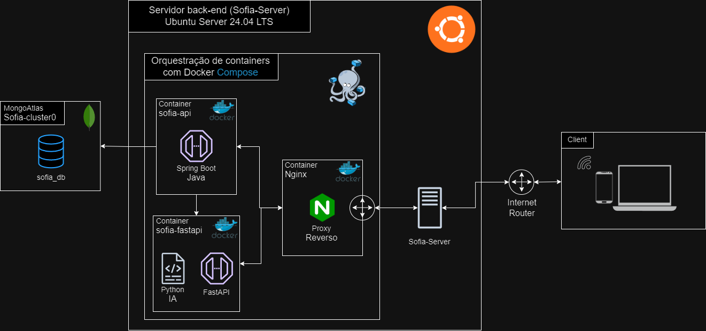

# Sofia-Server  💜

A infraestrutura do back-end do projeto **SOFIA** é composta por um servidor **Linux** rodando **Ubuntu Server 24.04 LTS**, com a orquestração de containers **Docker** utilizando o **Docker Compose**. Esta infraestrutura foi projetada para ser robusta, escalável e fácil de provisionar.

A criação do sistema foi realizada em diferentes ambientes:

- **Localmente**: Via **WSL2** e virtualização utilizando **VirtualBox** com **Vagrant**.
- **Nuvem**: Uma instância **EC2** configurada na **AWS**.

<div align='center'>

</div>

## Arquitetura  💜

### Componentes Principais

1. **Servidor SOFIA-Server (Ubuntu 24.04 LTS)**:

    - Sistema operacional que hospeda o **Docker** e orquestra os containers.
    - Gerencia o proxy reverso (**NGINX**) e as APIs.

2. **Banco de Dados MongoDB (Atlas)**:

    - Utiliza o cluster `Sofia-cluster0` no **MongoDB Atlas**.
    - Gerencia o banco de dados `sofia_db`.

3. **Containers Docker**:

    - **sofia-api**:
        - Aplicação **Java Spring Boot** para gerenciamento de dados do sistema e autenticação via **JWT**.
        - Comunicação com o **MongoDB Atlas**.

    - **sofia-fastapi**:
        - API em **Python** com **FastAPI**, para predição de sinais do TEA com um modelo de IA treinado com Multilayer PErceptron (MLP).

    - **Nginx**:
        - Proxy reverso para gerenciar e encaminhar requisições entre o cliente e as APIs.

    - **MongoDB**:
        - Para criar a base de dados localmente em um volume **Docker**, caso não tenha a URL de acesso ao cluster no **MongoDB Atlas**.

4. **Cliente**:
    - Dispositivos como smartphones e computadores conectados via internet ao servidor.

### Comunicação 

- O **Nginx** atua como proxy reverso, roteando solicitações dos clientes para os serviços apropriados.
- O container `sofia-api` utiliza variáveis de ambiente para conectar-se ao **MongoDB Atlas**, garantindo segurança e flexibilidade.
- O banco de dados **MongoDB Atlas** é externo, facilitando a escalabilidade e a persistência dos dados.


## Provisionamento do Servidor  💜

O provisionamento do sistema é automatizado utilizando um script Bash ([provision.sh](./provision.sh)) e segue os princípios de Infrastructure as Code (IaC).


### Passo a Passo

1. Criar o diretório do projeto no servidor Ubuntu:

```bash
mkdir sofia-infra
cd sofia-infra
```

2. Criar o script de provisionamento:

    - Utilize o editor `nano` para criar o arquivo `provision.sh`

    ```bash
    nano provision.sh
    ```

    - Cole o conteúdo do [script](./provision.sh) fornecido. 

    (Obs.: No editor `nano`, pressione `CTRL + O` para salvar e `CTRL + X` para sair do editor.)


3. Tornar o script executável:

```bash
chmod +x provision.sh
```

4. Executar o script:

```bash
./provision.sh
```

### Descrição do Script provision.sh  💜

O script realiza as seguintes operações:

1. **Atualização do sistema**:
    - Atualiza pacotes e dependências do sistema operacional.

2. **Instalação de dependências**:
    - **Docker** e **Docker Compose** para orquestração de containers.
    - **Git** para controle de versão e baixar o projeto do **Github**.

3. **Clonagem do repositório do projeto**:
    - O repositório contém o arquivo `docker-compose.yml` para configuração dos serviços e o arquivo `nginx.conf` para configuração do **Nginx**.

4. **Orquestração do Docker Compose**:
    - Sobe os serviços `mongodb`, `sofia-api`, `sofia-fastapi` e `nginx`.

#

#### Tecnologias 💜

<div align='center'>
     <br>
    
    
    
    
    
    

</div>